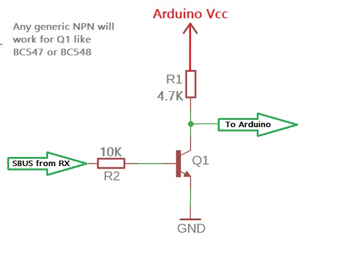

# SBUS Library for Arduino
Library for decoding SBUS signals from a receiver.
  
It converts the raw values ​​(309-1690) into the standard range of 1000-2000 us for up to 10 channels.

Requires a supported Arduino board using Hardware Serial like ESP32, Pi-Pico, AVR (Mega 2560), Teensy, STM32, etc.

## Signal Inversion
An ESP32 has signal inversion in it's setup but most will need to make this simple signal inverter to be able to read the SBUS data with their controller.

As a bonus the inverter will do a level shift if your RX is 6V and your controller is 3V3 or 5V and remember connect all grounds together.

</br>

<p align="center">
  
</p>

## How to use
### Generic
### Defaults
  1. Throttle channel = 3
  2. Throttle default value = 1000μs
  3. Hardware Serial1 TX and RX pins
```cpp
#include <SBUS.h>
SBUS sbus(Serial1);

void setup() {
  //Uses boards library defined pins for Serial1 and no signal inversion for ESP32
  sbus.begin(); 
}
void loop() {
  sbus.update();
  uint16_t ch3 = sbus.getChannel(3);
}
```
### Re-define TX/RX pin's (ESP32 RP2040)
```cpp
#include <SBUS.h>
SBUS sbus(Serial1);

void setup() {
  //By default this enables signal inversion for ESP32
  sbus.begin(/*rxPin*/ 12, /*txPin*/ 13); 
}
void loop() {
  sbus.update();
  uint16_t ch3 = sbus.getChannel(3);
}
```
### Define TX/RX pin's and signal inversion (ESP32)
```cpp
#include <SBUS.h>
SBUS sbus(Serial2);

void setup() {
  //By default this enables signal inversion for ESP32
  sbus.begin(/*rxPin*/ 16, /*txPin*/ 17, /*inversion*/ false); 
}
void loop() {
  sbus.update();
  uint16_t ch3 = sbus.getChannel(3);
}
```
### All options
```cpp
#include <SBUS.h>

#define TX1 27
#define RX1 26
#define THR_CH 1      //Spektrum Air TX
#define THR_VAL 1900  //Spektrum Throttle Off (Not Reversed)

SBUS sbus(Serial1, THR_CH, THR_VAL);

void setup() {
  //By default this enables signal inversion for ESP32
  sbus.begin(RX1, TX1, false); 
}
void loop() {
  sbus.update();
  uint16_t ch3 = sbus.getChannel(1);
}
```
